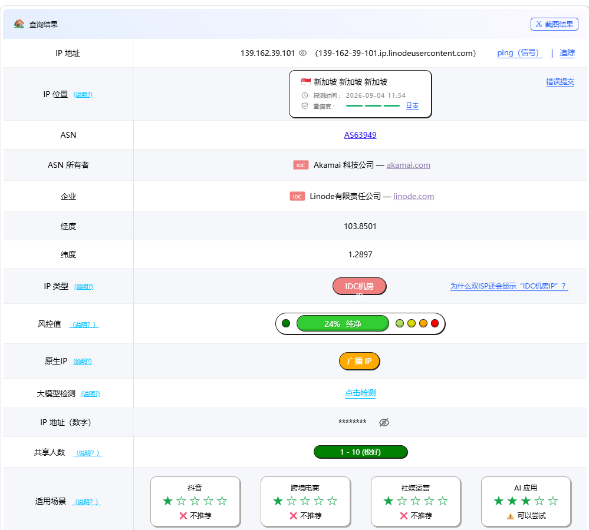
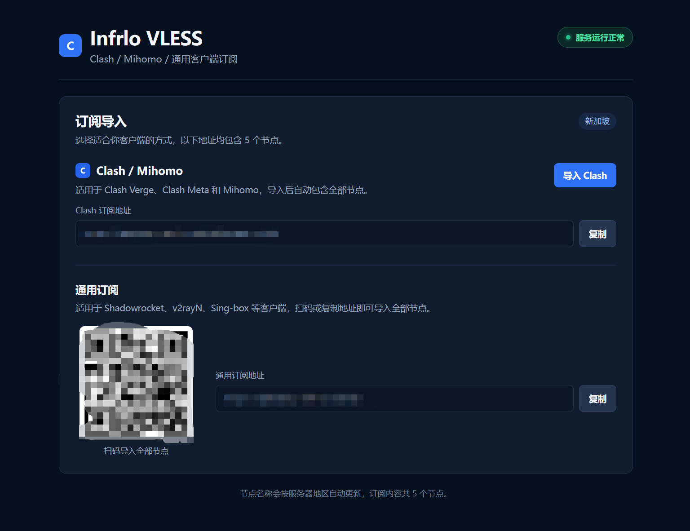
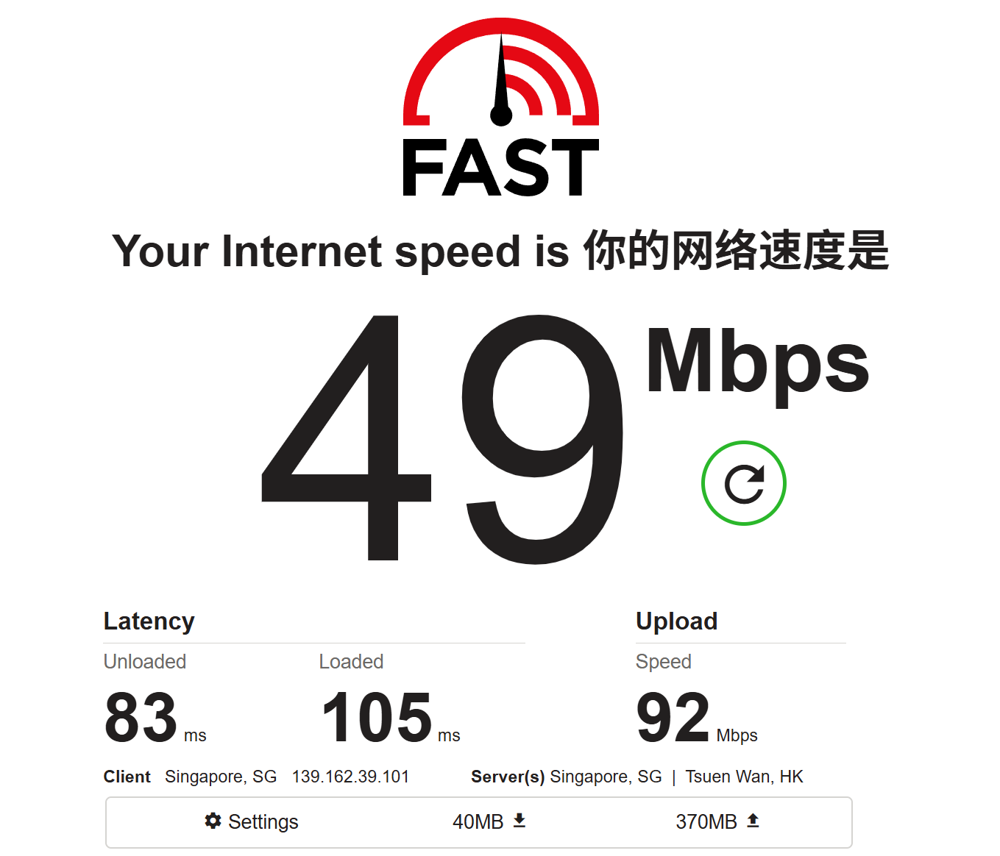

# 实测结果

测试时间以截图记录为准。网络质量、IP 风控和测速结果会随部署节点、运营商与本地网络环境变化。

## IP 与风控

| 项目 | 结果 |
|------|------|
| IP 地址 | `139.162.39.101` |
| 反向解析 | `139-162-39-101.ip.linodeusercontent.com` |
| IP 位置 | 新加坡 |
| ASN | `AS63949` |
| ASN 所有者 | Akamai 科技公司 / Linode |
| IP 类型 | IDC 机房 |
| 风控值 | 24%，纯净 |
| 原生 IP | 广播 IP |
| 共享人数 | 1 - 10 |

适用场景检测结果：

- 抖音：不推荐
- 跨境电商：不推荐
- 社媒运营：不推荐
- AI 应用：可以尝试

## 订阅页面

页面提供：

- Clash / Mihomo 一键导入
- Clash 订阅地址与复制按钮
- 通用订阅地址与复制按钮
- 全部 5 个节点的二维码导入
- 自动显示当前部署地区，截图中为新加坡

## 速度测试

| 项目 | 结果 |
|------|------|
| 下载速度 | 49 Mbps |
| 上传速度 | 92 Mbps |
| 空闲延迟 | 83 ms |
| 负载延迟 | 105 ms |
| 客户端地区 | Singapore, SG |
| 客户端 IP | `139.162.39.101` |
| 测速服务器 | Singapore, SG / Tsuen Wan, HK |
| 测试流量 | 下载 40 MB，上传 370 MB |
